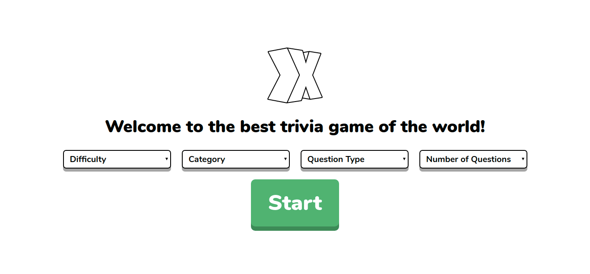

  
# Trivia Game



A trivia game that have been built with [ReactJS](https://reactjs.org/). The project uses [Open Trivia DB](https://opentdb.com/) to retrieve questions.

The game's features:
- 4 seletion on welcome page,
	- Questions Difficulty
	- Questions Category
	- Questions Type (Multiple Choice / True-False)
	- Number of Questions (Min. 10)
- If user selects the wrong answer, game ends.
- Questions are fetched from Open Trivia Database Api
- Lottie Animations

You can try the game on: [Trivia Game](https://keen-jackson-d2cfec.netlify.app/) 

To run the project:
```
npm install
```
Development server:
```
npm run dev-server
```
Production build/bundle:
```
npm run prod-build
```
